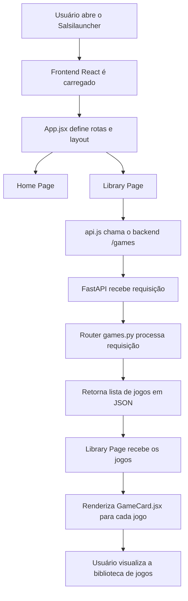

# Salsilauncher (versão de testes)

O Salsilauncher é um protótipo de um launcher de jogos com interface desenvolvida em React e backend em FastAPI.  
O projeto ainda está em desenvolvimento inicial e esta versão serve como base estrutural para organizar a arquitetura e iniciar o fluxo de comunicação entre frontend e backend.

## Estrutura do Projeto

```
salsilauncher-teste/
│
├── backend/
│   ├── main.py
│   ├── requirements.txt
│   ├── routers/
│   │   └── games.py
│   └── models/
│       └── game.py
│
├── frontend/
│   ├── src/
│   │   ├── App.jsx
│   │   ├── main.jsx
│   │   ├── pages/
│   │   │   ├── Home.jsx
│   │   │   └── Library.jsx
│   │   ├── components/
│   │   │   └── GameCard.jsx
│   │   └── services/
│   │       └── api.js
│   └── package.json
│
└── README.md
```

## Fluxograma do Funcionamento



## Como Rodar o Projeto

### Backend (FastAPI)

```
cd backend
python -m venv venv
venv\Scripts\activate
pip install -r requirements.txt
uvicorn main:app --reload
```

### Frontend (React + Vite)

```
cd frontend
npm install
npm run dev
```

## Endpoints Atuais

### GET /games

Retorna a lista de jogos de teste definida em `routers/games.py`.

```json
[
  {
    "id": 1,
    "name": "Hollow Knight",
    "path": "C:/Games/HollowKnight/HollowKnight.exe"
  }
]
```

## Arquitetura do Projeto

### Backend
- Desenvolvido com FastAPI.
- Roteadores em `routers/`.
- Modelos em `models/`.
- Endpoints básicos, retornando dados estáticos.

### Frontend
- Desenvolvido com React (Vite).
- Navegação definida em `App.jsx`.
- Páginas: Home e Library.
- Componente `GameCard.jsx`.
- Comunicação via `services/api.js`.

## Melhorias Sugeridas

### Backend
- Adicionar banco de dados.
- Criar CRUD de jogos.
- Implementar detecção automática de executáveis.

### Frontend
- Criar estado global.
- Criar modal para adicionar jogos.
- Adicionar tratamento de erros.

### Estrutura Geral
- Criar documentação em `/docs`.
- Preparar integração com Electron.

## Status Atual

- Estrutura inicial do backend pronta
- Estrutura inicial do frontend pronta
- Comunicação React → FastAPI funcionando
- Projeto pronto para expansão

## Licença

MIT
